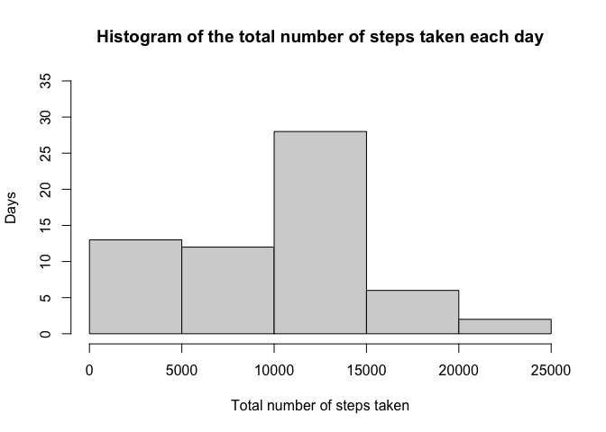
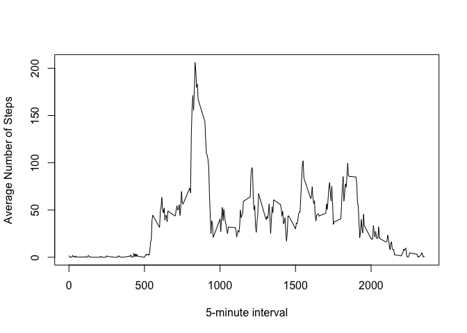
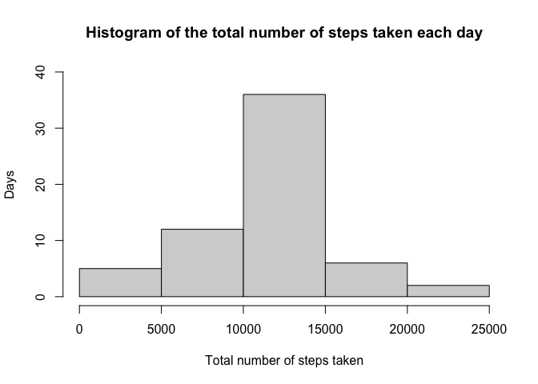
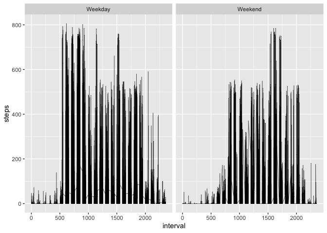

## Loading and preprocessing the data

##### Download EC data files from the web, unzip them, and specify time/date settings


```r
direct <- getwd()
setwd(direct)
URL <- "https://d396qusza40orc.cloudfront.net/repdata%2Fdata%2Factivity.zip"
Files <- "Activity monitoring data.zip"
if (!file.exists(Files)){
  download.file(URL, destfile = Files, mode="wb")
}
if (file.exists(Files)){
  unzip(Files)
}
dateDownloaded <- date()
activity <- read.csv("./activity.csv",header = T)
```

##### load all necessary libraries


```r
library(dplyr);library(lattice);library(tidyr);library(ggplot2);library(lubridate)
```

```
## 
## Attaching package: 'dplyr'
```

```
## The following objects are masked from 'package:stats':
## 
##     filter, lag
```

```
## The following objects are masked from 'package:base':
## 
##     intersect, setdiff, setequal, union
```

```
## Loading required package: timechange
```

```
## 
## Attaching package: 'lubridate'
```

```
## The following objects are masked from 'package:base':
## 
##     date, intersect, setdiff, union
```

## What is mean total number of steps taken per day?

##### Calculate the total number of steps taken per day


```r
StepsPerDay <- activity %>% group_by(date) %>% 
  summarise(SPD = sum(steps,na.rm = T))
```

##### Plot a histogram of the total number of steps taken each day


```r
hist(StepsPerDay$SPD,ylim = c(0,35), 
     xlab = "Total number of steps taken",
     ylab = "Days",
     main = "Histogram of the total number of steps taken each day")
```

<!-- -->

##### Calculate and report the mean and median of the total number of steps taken per day


```r
MeanPerDayTotal <- mean(StepsPerDay$SPD,na.rm = T)
MedianPerDayTotal <- median(StepsPerDay$SPD,na.rm = T)
```

## What is the average daily activity pattern?

##### Make a time series plot of the 5-minute interval (x-axis) and the average number of steps taken, averaged across all days (y-axis)


```r
AvgDaily <- activity %>% 
  group_by(interval) %>% 
  summarise(AvgSteps = mean(steps,na.rm = T))

plot(AvgDaily$interval,AvgDaily$AvgSteps,type = "l",
     main = NULL,xlab = "5-minute interval",ylab = "Average Number of Steps")
```

<!-- -->

##### Which 5-minute interval, on average across all the days in the dataset, contains the maximum number of steps?


```r
MaxInterval <- (AvgDaily %>% 
                  filter(AvgDaily$AvgSteps == max(AvgDaily$AvgSteps)))$interval
```

## Imputing missing values

##### Calculate and report the total number of missing values in the dataset (i.e. the total number of rows with NAs)


```r
TotalNAs <- length(is.na(activity$steps))
```

##### Devise a strategy for filling in all of the missing values in the dataset. The strategy does not need to be sophisticated. For example, you could use the mean/median for that day, or the mean for that 5-minute interval, etc.


```r
activity2 <- activity %>% 
  group_by(interval) %>% 
  left_join(AvgDaily, by = "interval")
activity2$steps[is.na(activity2$steps)] <- activity2$AvgSteps
```

```
## Warning in activity2$steps[is.na(activity2$steps)] <- activity2$AvgSteps: number
## of items to replace is not a multiple of replacement length
```

##### Calculate the total number of steps taken per day


```r
StepsPerDay2 <- activity2 %>% group_by(date) %>% summarise(SPD = sum(steps,na.rm = T))
```

##### Plot a histogram of the total number of steps taken each day


```r
hist(StepsPerDay2$SPD,ylim = c(0,40), 
     xlab = "Total number of steps taken",
     ylab = "Days",
     main = "Histogram of the total number of steps taken each day")
```

<!-- -->

##### Calculate and report the mean and median of the total number of steps taken per day


```r
MeanPerDayTotal2 <- mean(StepsPerDay2$SPD,na.rm = T)
MedianPerDayTotal2 <- median(StepsPerDay2$SPD,na.rm = T)
```

## Are there differences in activity patterns between weekdays and weekends?

##### Create a new factor variable in the dataset with two levels -- "weekday" and "weekend" indicating whether a given date is a weekday or weekend day


```r
activity3 <- activity2 %>% mutate(weekday = weekdays(ymd(date)))
WeekD <- factor(activity3$weekday,
                levels = c("Monday", "Tuesday", "Wednesday", "Thursday", 
                           "Friday", "Saturday", "Sunday"), 
                ordered = TRUE)
Week <- which(as.numeric(WeekD) < 6)
Week2 <- which(as.numeric(WeekD) > 5)
activity3$weekday <- replace(activity3$weekday, Week, "Weekday")
activity3$weekday <- replace(activity3$weekday, Week2, "Weekend")
```

##### Make a panel plot containing a time series plot (i.e. \color{red}{\verb|type = "l"|}type = "l") of the 5-minute interval (x-axis) and the average number of steps taken, averaged across all weekday days or weekend days (y-axis). See the README file in the GitHub repository to see an example of what this plot should look like using simulated data.


```r
par(mfrow = c(1,2))
ggplot(data = activity3, aes(interval,steps)) + 
  geom_line(color = "black", linewidth = 0.2) + 
  facet_wrap(~weekday)
```

<!-- -->
